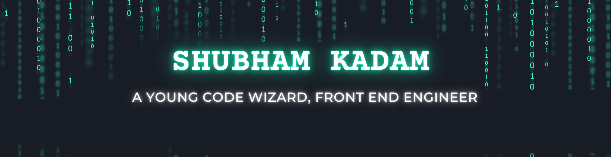

  
 

<h2>📫 Connect with me</h2>

 
<h2 align="center">📊 Github Stats</h2>

 

<h2 align="center">🛠️ Languages and Tools</h2>

<h3 align="left">🏄‍♂️ Frontend</h3>

<h3 align="left">🧰 Backend</h3>

<h3 align="left">🗄️ Database</h3>

<h3 align="left"> 💻 Additional Programming Languages and Tools</h3>

