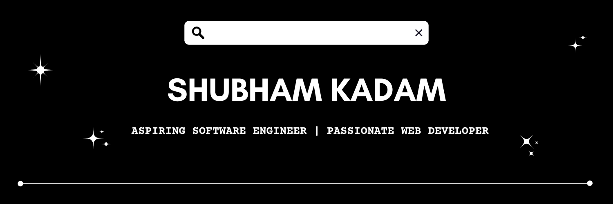

I have a passion for programming in web. My objective is to get better in crafting and developing scalable, maintainable and user-friendly web applications that provide a seamless user experience. I am constantly acquiring knowledge and experimenting new technologies and frameworks to find the best solutions to the problems at hand.

 
<!---

- Web illustrations by Storyset ( https://storyset.com/web )
--->

<!---

--->

 

- 🌱 I’m currently learning **React and Node.js**.
- 📫 How to reach me: **shubhamskadam99@outlook.com**.
- 👯 I’m looking to collaborate on **Developing new open-source projects**.

 

&nbsp;

  
